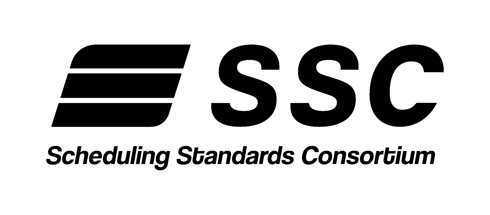

> **This repository has moved.** The SSC Appointment Scheduling API spec now lives at [dsdcapis/full-truckload](https://github.com/dsdcapis/full-truckload/tree/main/api-specs/ssc). Please update your bookmarks, links, and integrations to reference the new location; this repository is retained for historical reference only and is no longer updated.

# SSC - Scheduling Standards Consortium

Convoy, J.B. Hunt and Uber Freight formed the Scheduling Standards Consortium (SSC) to simplify the integration of systems across the fragmented ecosystem between shippers, carriers and intermediaries and create a more efficient appointment scheduling process.

For more details about the Consortium, check out [freightapis.org](https://www.freightapis.org/).

## Read the Spec

To read the spec, visit [freightapis.github.io/ssc](https://freightapis.github.io/ssc).

## Feedback and Discussion

Please use the [discussions tab](https://github.com/freightapis/ssc/discussions) to leave feedback on the specification. If you find any specific issues with the specifications, please create an issue in the [issues tab](https://github.com/freightapis/ssc/issues).
